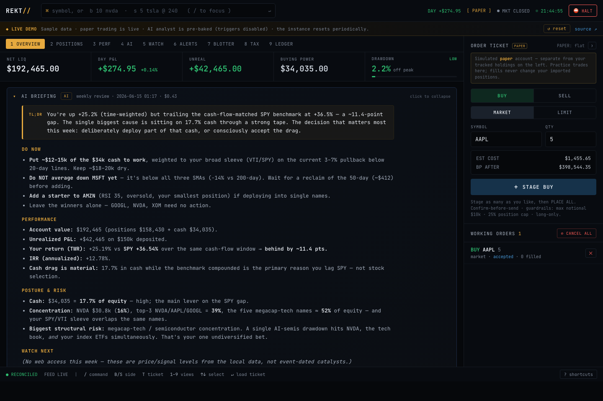

# REKT — Real-time Equity & Capital Tracker

> Find out exactly how rekt you are, live — and do something about it.

A self-hosted, single-user web dashboard for **tracking and trading** a US
stocks & ETFs portfolio in real time, with an AI analyst watching over your
shoulder. One Rust binary, one SQLite file, your keys never leave your box.

### ▶ Live demo — **https://rekt-production-545b.up.railway.app**

A fully working instance with a sample portfolio: real charts and market
gauges, live paper trading, and pre-generated AI analyses. Trading and
watchlists are live; the AI tabs are pre-baked (no spend); it resets to the
sample data every few hours, or hit **↺ reset** in the banner. *(Demo keys are
throwaway; don't enter anything real.)*



---

## What it does

- **📒 Tracks your real book.** Import your activity history (deposits, buys,
  sells, dividends, splits) from Fidelity, Schwab, Robinhood, IBKR, or a generic
  CSV; REKT replays it into positions, cost basis, realized/unrealized P&L, an
  equity curve vs. SPY, and tax lots. Money is exact decimals, never floats.
- **📈 Paper-trades for real.** A built-in order ticket trades a simulated Alpaca
  paper account (market/limit, basket orders) with guardrails — per-order
  notional cap, max position %, daily order count, and a daily-loss circuit
  breaker. Paper fills are strictly segregated from your tracked book.
- **🤖 An AI analyst on your shoulder — advisory only.** Morning briefings,
  weekly deep reviews (with web search), and on-demand Q&A over your portfolio.
  It **can never place orders**: no code path to the broker, read-only tools,
  and recommendations only *prefill* the guarded order ticket you confirm. Every
  recommendation is **scored against what the price actually did** (direction-
  adjusted), and the analyst sees its own track record before making new calls.
  Runs on the local **Claude Code CLI** by default (reuses your `claude` login —
  no API key), the **Claude API**, or a **local Ollama model** (free, private,
  offline).
- **🔭 Finds ideas across the market.** A deterministic screener ranks buy/sell
  candidates from your **named watchlists** (RSI / SMA distance / drawdown), with
  per-equity-type **aggressiveness** (separate for stocks vs ETFs). The AI then
  *narrates* the ranked candidates — so the picks are trustworthy math, not a
  hallucination, and a small local model is enough. Plus **market gauges**
  (SPY / QQQ / IWM / DIA with live RSI/trend) and a daily **state-of-market
  brief** grounded in those gauges.
- **🔔 Alerts that become actions.** Price-above / price-below / drawdown alerts
  with optional push (ntfy). A triggered alert can pre-stage an order ticket for
  one-click review — it never trades on its own.
- **🧾 Taxes done properly.** Per-lot Form 8949 rows with full **wash-sale**
  treatment (IRC §1091, code W): disallowed losses carry forward into the
  replacement lot's basis with the holding period tacked on, matching broker
  1099-B practice. Schedule D totals and CSV export. *(Same-symbol matching;
  reconcile with your 1099-B; not tax advice.)*
- **🗂 Multiple portfolios.** Keep a `test` book and your `real` data side by
  side, each its own SQLite file; switch from the header.
- **🔒 Yours, honestly.** One process, one file, keys are env-only (never logged
  or sent to the browser). Missing data or keys produce clear errors or `None` —
  **never fabricated values**.

## Setup

> Just want to look around first? Try the **[live demo](https://rekt-production-545b.up.railway.app)** — no setup, no keys.

### 1. Prerequisites

- **Rust** (stable) — install via [rustup.rs](https://rustup.rs). REKT pins its
  toolchain in `rust-toolchain.toml`, so the right version is fetched
  automatically. *(Or skip Rust entirely and use Docker — see below.)*
- A free **Finnhub** and **Alpaca** account for the API keys below.

### 2. Get your API keys

All keys are **free** and read from the environment at startup — they're never
written to disk, logged, or sent to the browser. Everything degrades honestly:
leave a key out and the affected feature shows a clear error instead of faking
it, so you can start with just Finnhub and add the rest later.

| Key | What it powers | Required? | Where to get it |
|-----|----------------|-----------|-----------------|
| `FINNHUB_API_KEY` | Live quotes & prices | **Recommended** (no live prices without it) | [finnhub.io](https://finnhub.io) → free account → Dashboard → API key |
| `ALPACA_PAPER_KEY` + `ALPACA_PAPER_SECRET` | Daily candles (charts, gauges, signals) **and** paper trading | **Recommended** (no charts/paper trading without it) | [alpaca.markets](https://alpaca.markets) → free account → **Paper** trading → "View / Generate API Keys". Paper keys only — live trading is deliberately not wired up. |
| AI analyst | Briefings, weekly reviews, market ideas, Q&A | Optional | **Three options — pick one:** see step 3 |

You only strictly need Rust to *launch* it; with **zero keys** REKT still runs as
a transaction ledger (import history, positions, cost basis, P&L, taxes) — you
just won't get live prices, charts, paper trading, or AI.

### 3. Choose an AI backend (optional)

The analyst is advisory only — it can never place orders. Pick one backend (or
none):

- **Claude Code CLI** *(default — no API key)*: if you have the `claude` CLI on
  your `PATH` and signed in, REKT reuses that auth. Nothing to configure.
- **Claude API**: `export REKT_ANALYST_BACKEND=http` and
  `export ANTHROPIC_API_KEY=your_key` (from [console.anthropic.com](https://console.anthropic.com)).
- **Local Ollama** *(free, private, offline)*: `export REKT_ANALYST_BACKEND=ollama`,
  then `ollama pull llama3.1`. The deterministic screener does the picking, so a
  small local model is enough.

### 4. Run it

```sh
export FINNHUB_API_KEY=your_key
export ALPACA_PAPER_KEY=your_key
export ALPACA_PAPER_SECRET=your_secret
# (optional AI backend — see step 3; the default needs nothing)

cargo run -p rekt-server
# → open http://127.0.0.1:7777
```

**Or with Docker** (no Rust toolchain needed):

```sh
docker build -t rekt .
docker run -p 7777:8080 \
  -e FINNHUB_API_KEY=your_key \
  -e ALPACA_PAPER_KEY=your_key -e ALPACA_PAPER_SECRET=your_secret \
  -v rekt-data:/data \
  rekt
# → open http://127.0.0.1:7777   (the -v volume persists your data)
```

Then **import your portfolio** (next section) to populate it. The full env-var
reference — guardrails, AI budget (`REKT_AI_DAILY_BUDGET`), alert push, the
listen address (`REKT_LISTEN`, default `127.0.0.1:7777`), and multiple
portfolios — is in [docs/OPERATIONS.md](docs/OPERATIONS.md).

## Bringing over your portfolio

REKT is a transaction ledger: you import your **activity history** (deposits,
buys, sells, dividends) and it replays them into positions, cost basis, P&L,
and tax lots. Import the full history for accurate realized gains and
wash-sale handling — a snapshot of current holdings alone won't reconstruct
those.

Use the **⬆ IMPORT CSV** button on the Blotter tab. Pick a format — **Generic**
(REKT's native `kind,symbol,qty,price,fees,taxes,ts,note`) or a broker export
(**Fidelity**, **Schwab**, **Robinhood**, **Interactive Brokers**) — drop in a
file or paste the CSV, then **Preview** to see exactly what will import and what
gets skipped (and why) before you **Confirm**. Broker exports can be pasted raw,
preamble and all; rows that aren't portfolio transactions (interest, fees,
options, journal entries) are reported as skips, never silently dropped. The
same thing is scriptable: `POST /api/import/csv?format=robinhood`
(add `&dry_run=true` for the preview).

Two broker-specific notes: **splits** are reported but not auto-applied (broker
exports give a share delta, not a clean ratio — enter them manually), and
**Robinhood crypto** trades use the same buy/sell codes as equities and would
import as if they were stocks, so review the preview before confirming.

## Running it for real

Deployment (systemd or Docker), reverse-proxy + TLS, SQLite backup/restore,
monitoring via `/api/health`, the security posture, and the deliberate
paper-only stance on live trading are all in
[docs/OPERATIONS.md](docs/OPERATIONS.md). The short version: it's one binary and
one SQLite file, it binds loopback with no built-in auth (front it with a TLS
proxy to expose it), and you back it up with
`sqlite3 rekt.db "VACUUM INTO 'backup.db'"` while it's live.

**Host your own public demo** (like the one above) with `REKT_DEMO=1`: the AI
analyst is forced off (pre-baked analyses, no spend), cost-bearing/destructive
routes are blocked, and a baked sample portfolio self-heals on a timer. Deploy
to [Railway](https://railway.app) from the included `Dockerfile` — see the
[Public demo](docs/OPERATIONS.md#public-demo-railway) section.

## Development

```sh
cargo fmt --all --check
cargo clippy --workspace --all-targets -- -D warnings
cargo test --workspace
```

The toolchain is pinned in `rust-toolchain.toml` so local and CI match. The UI
is a single vanilla-JS file (`crates/rekt-server/assets/index.html`) embedded
into the binary — no build step, no framework.

Workspace layout:

```
crates/rekt-core/     domain types + pure portfolio math + guardrails (I/O-free)
crates/rekt-data/     MarketData trait + provider impls (Finnhub, Alpaca)
crates/rekt-broker/   Broker trait + Alpaca impl (orders, fills, account)
crates/rekt-analyst/  AI client (CLI / API / Ollama) + tool loop + cost metering
                      (advisory only — never depends on rekt-broker)
crates/rekt-server/   axum API, SQLite, order manager, screener, embedded UI
migrations/           sqlx migrations
```

See [PLAN.md](PLAN.md) for the full design and roadmap, and
[docs/RESEARCH.md](docs/RESEARCH.md) for the research behind it.

## License

[AGPL-3.0](LICENSE) — self-host freely; if you run a modified REKT as a
service, share your changes.

REKT is analysis and tooling, **not financial advice**. Trading involves
risk of loss. Paper-trade first.
